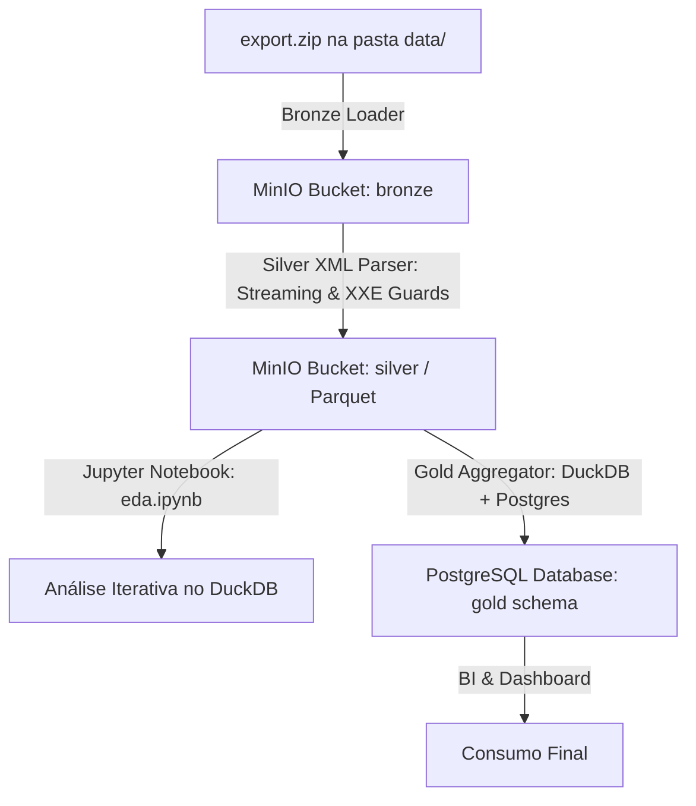

# Apple Watch Medallion Data Pipeline (Local & Scalable)

Este projeto implementa um pipeline de dados local e escalável seguindo a **Arquitetura Medalhão** (Bronze, Silver e Gold) para ingestão e análise de dados históricos exportados do **Apple Watch**.

O pipeline utiliza **MinIO** como Data Lake de objetos, **DuckDB** como motor analítico de transformações (lendo Parquet diretamente via S3 local) e **PostgreSQL** como base relacional final de consumo.

---

## 🏗️ Arquitetura de Dados



### Definições de Camadas:
1. **Bronze (Raw)**: Armazena o arquivo exportado original do Apple Watch (`export.zip`) de forma imutável e histórica.
2. **Silver (Conformed/Cleaned)**: Processa o `export.xml` em streaming de memória constante, limpa tipos e campos, e salva as métricas como arquivos **Parquet** de alta performance particionados por tipo em buckets locais.
3. **Gold (Business/Serving)**: Agrega os dados diários (médias de batimentos cardíacos, totais de passos, treinos completos) e os insere em tabelas relacionais do **PostgreSql** usando transações de upsert (`ON CONFLICT`).

---

## 📂 Estrutura de Diretórios

```
.
├── docker-compose.yml     # Containers do MinIO e PostgreSQL
├── Makefile               # Atalhos para comandos rápidos
├── pyproject.toml         # Dependências do projeto (uv/pip)
├── eda.py                 # Script Python interativo (# %%) para análise exploratória
├── DATA_DICTIONARY.md     # Dicionário detalhado de colunas e tabelas
├── config/
│   ├── settings.yaml      # Configurações ativas de portas/banco/s3
│   └── settings.yaml.template
├── data/                  # Pasta para colocar os ZIPs do Apple Watch
└── src/
    ├── bronze/
    │   └── raw_loader.py  # Ingestão de Bronze (carrega e gera dados de teste)
    ├── silver/
    │   └── xml_parser.py  # Parser streaming XML para Parquet com segurança
    ├── gold/
    │   └── aggregator.py  # Agregador final executando queries no DuckDB para Postgres
    └── utils/
        ├── db.py          # Conector e DDL do PostgreSQL
        └── minio_client.py# Conector SDK do MinIO
```

---

## ⚡ Guia Rápido de Comandos

O gerenciamento de execução e infraestrutura do pipeline é automatizado no **Makefile**:

### 1. Iniciar a Infraestrutura (MinIO + Postgres)
```bash
make infra-up
```
*O console do MinIO estará acessível em: `http://localhost:9001` (user: `minioadmin` / password: `minioadminpassword`)*

### 2. Rodar o Pipeline Completo (E2E)
Coloque o seu arquivo ZIP extraído do relógio na pasta `data/` com o nome `export.zip` e execute:
```bash
make run-all
```
*(Nota: Se a pasta `data/` estiver vazia, o pipeline gerará automaticamente 60 dias de histórico simulado para testes).*

### 3. Desligar a Infraestrutura e Limpar Volumes
```bash
make infra-down
```

---

## 📓 Como Usar o Script Interativo para Análise Exploratória (EDA)

Migramos nossa ferramenta de exploração de dados para um script Python interativo (**`eda.py`**), utilizando o formato de células (`# %%`). Isso permite que você execute consultas de forma interativa célula por célula sem precisar de arquivos binários `.ipynb`.

1. **Abra o projeto no VS Code ou Cursor**.
2. **Abra o arquivo [eda.py](eda.py)**.
3. Se você possuir a extensão do Python instalada, verá botões do tipo **"Run Cell"** ou **"Run Below"** logo acima de cada linha iniciada com `# %%`.
4. Clique em **"Run Cell"** (ou use o atalho `Shift+Enter` com o cursor posicionado na célula) para executar o bloco de código. O resultado (DataFrames das tabelas do MinIO) será renderizado em uma janela interativa ao lado!
5. Para consultar o significado e tipos das colunas, consulte o [DATA_DICTIONARY.md](DATA_DICTIONARY.md).