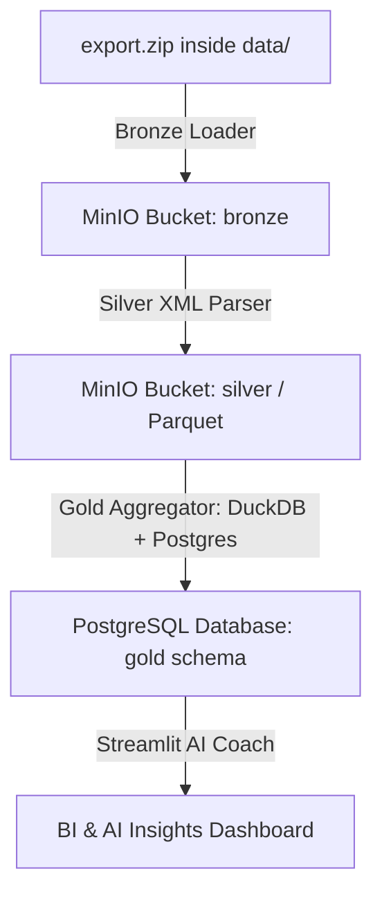

# Apple Watch Medallion Data Pipeline (Local & Scalable)

This project implements a local, scalable data pipeline following the **Medallion Architecture** (Bronze, Silver, and Gold) to ingest and analyze historical health data exported from the **Apple Watch**.

The pipeline uses **MinIO** as the Object Storage Data Lake, **DuckDB** as the analytical query engine (directly querying Parquet files via S3), and **PostgreSQL** as the final serving relational database.

---

## 🏗️ Data Architecture



### Layer Definitions:
1. **Bronze (Raw)**: Stores the original Apple Watch export zip archive (`export.zip`) immutably.
2. **Silver (Conformed/Cleaned)**: Streams the `export.xml` using constant memory, cleans types/fields, and saves metrics as high-performance **Parquet** files partitioned by type and date.
3. **Gold (Business/Serving)**: Aggregates daily summaries (resting heart rate, steps, sleep stages, workouts) using DuckDB, and inserts them into PostgreSQL with idempotent upserts.

---

## 📂 Project Structure

```
.
├── docker-compose.yml     # Containers for MinIO, PostgreSQL, and Ollama
├── Makefile               # Quick command automation shortcuts
├── pyproject.toml         # Project dependencies (uv/pip)
├── dashboard.py           # Streamlit AI Dashboard and Chatbot (Ollama & Groq API)
├── DATA_DICTIONARY.md     # Health tables schema documentation
├── config/
│   └── settings.yaml      # Configuration details for database, MinIO, and schema
├── data/                  # Root folder to place your Apple Watch export.zip
└── src/
    ├── bronze/
    │   └── raw_loader.py  # Bronze loader (uploads export.zip to MinIO)
    ├── silver/
    │   └── xml_parser.py  # Secure memory-constant XML-to-Parquet streaming parser
    ├── gold/
    │   └── aggregator.py  # DuckDB-based metrics aggregation loader to Postgres
    └── utils/
        ├── db.py          # PostgreSQL tables DDL and connections
        └── minio_client.py# MinIO SDK connections
```

---

## ⚡ Command Guide

All orchestration commands are automated via the **Makefile**:

### 1. Start Infrastructure (MinIO + Postgres + Ollama)
```bash
make infra-up
```
- MinIO Console: `http://localhost:9001` (user: `minioadmin` / password: `minioadminpassword`)
- Postgres port: `5432` (user: `postgres` / password: `postgrespassword`)

### 2. Run Complete Pipeline (E2E)
Place your exported ZIP file in the `data/` directory named `export.zip` and run:
```bash
make run-all
```

### 3. Run Streamlit AI Dashboard
Start the analytics dashboard:
```bash
.venv/bin/streamlit run dashboard.py
```
*Note: Set your AI preferences (Ollama or Groq API Key) directly in the sidebar.*

### 4. Stop Infrastructure & Clean Volumes
```bash
make infra-down
```